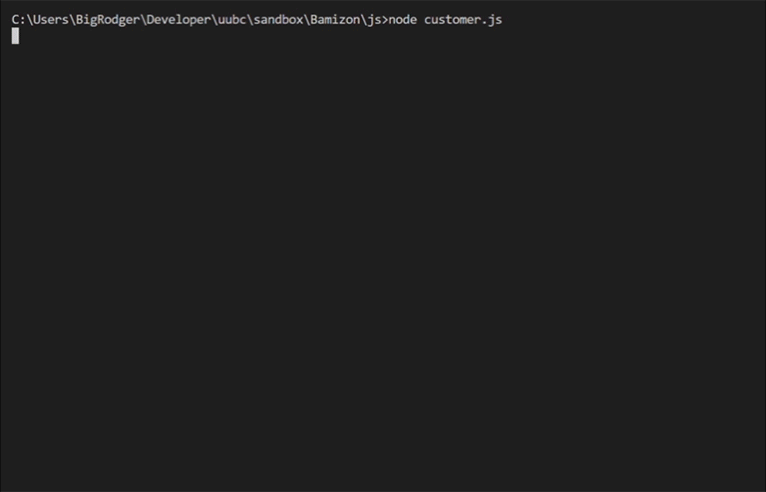
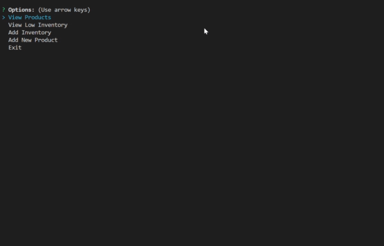
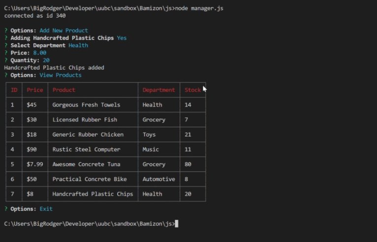
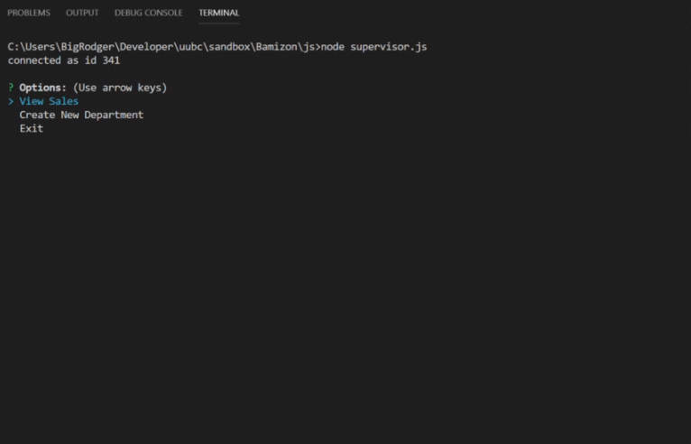

# Bamizon

## Overview

Bamizon is a mock CLI storefront built with Node.js. It was written as an exercise in interacting with database data and SQL queries. The application is divided into three basic functions; a 'Customer' view that allows users to view a product list and make purchases, a 'Manager' view where products can be as well as searching for low inventory specifically, and a 'Supervisor' view where users are able to view total profits and add new departments to the store.

Examples can be viewed below:

### Customer View

### Manager View

### Supervisor View

## Built With:
* node.js
* mySQL
* NPM Packages:
  * inquirer
  * mysql
  * cli-table

